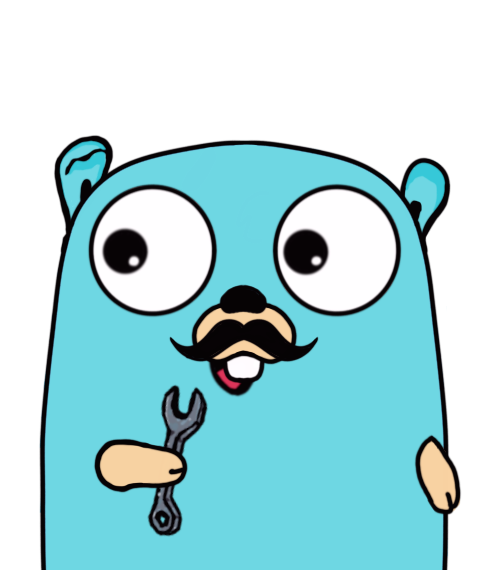

# Go Journey

| | |
|-|-|
|This repository contains educative content related Go-lang. Starting from the basics to advanced use cases of the language with code snippets and explanations.     I post all this information in GitHub because that way I have to dig a into language specific feature and not just reading thru internet and/or copying random code from different websites.      While checking the repo if there is something missing or can be improved feel free to send a pull request or open an issue in this same repo. |  |

## Table of content

|  Content                                          | Description                                                                     |
|---------------------------------------------------|---------------------------------------------------------------------------------|
| [1 Basics](./basics/)                             | Variables declaration, error handling maps, slices, go routines and references. |
| [2 Functions](./functions/functions.go)           | Functions parameters, return type and anonymous functions                       |
| [3 Poo/structs](./poo/structs/)                   | Data structures with getters setters and constructors                           |
| [3.1 Poo/factory](./poo/factory/)                 | Factory pattern implementation in go                                            |
| [4 Modules](./modules/)                           | Modules creation, implementation and alias                                      |
| [5 Testing/unit](./testing/unit)                  | Information about how to run tests, different tools and examples on unit test   |
| [5.1 Testing/mocks](./testing/mocks/)             | Example of mocked tests based on the example from inheritance                   |
|                                                   |                                                                                 |